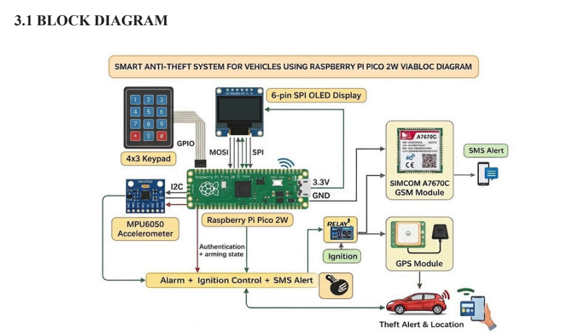
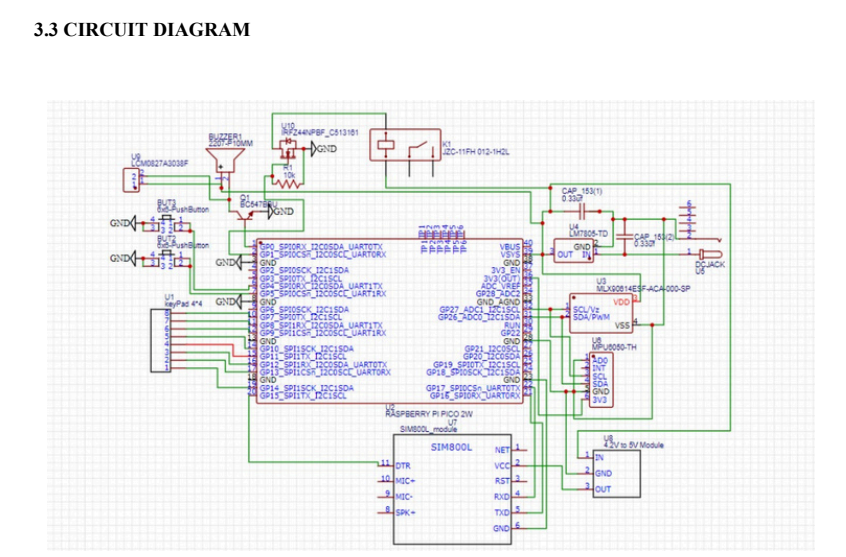

# 🚗 Smart Anti-Theft System for Vehicles using Raspberry Pi Pico 2W

An IoT-based vehicle security system developed using Raspberry Pi Pico 2W that provides password authentication, motion detection, GPS location tracking, GSM-based SMS alerts, and ignition control.

---

# 🏗 System Architecture



---

# 📖 Project Overview

This project enhances vehicle security using embedded systems and IoT technologies. It authenticates the user with a keypad password, continuously monitors vehicle movement using an MPU6050 sensor, and sends an SMS alert with location details through the GSM module when theft is detected.

---

# ✨ Features

- Password Authentication
- Motion Detection using MPU6050
- GPS Location Tracking
- GSM SMS Alert
- Relay-based Ignition Control
- OLED Display Interface
- Theft Alarm using Buzzer
- Raspberry Pi Pico 2W

---

# 🔌 Circuit Diagram



---

# 🛠 Hardware Used

- Raspberry Pi Pico 2W
- MPU6050 Accelerometer
- SIMCOM GSM Module
- GPS Module
- 4×3 Matrix Keypad
- OLED Display
- Relay Module
- Buzzer

---

# 💻 Software Used

- Arduino IDE
- Embedded C/C++
- Raspberry Pi Pico SDK
- GitHub

---

# 📁 Repository Structure

```
Source_Code/
Circuit_Diagram/
Images/
Report/
README.md
```

---

# 👥 Team Members

- Thej Krishna P. R.
- Abraham Joseph
- Abijith B.
- Jovit Jain

---

# 👨‍💻 My Contributions

- Raspberry Pi Pico 2W Programming
- Password Authentication
- Motion Detection
- Hardware Integration
- Testing and Debugging

---

# 📄 Report

The complete project report is available in the **Report** folder.

---

# 📜 License

MIT License
